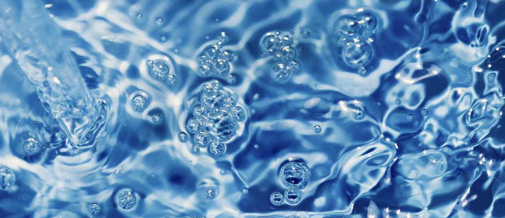

<html>
<head>
    
</head>
<body>
    
        <!-- Dropdown -->
       

        

            <button class='button artists' onclick="location.href='//ellierozen.github.io/csp2-/homepage';';">Click here for more!</button>
            

                <a href="puthtmlfilehere">Waterpolo Quiz </a>
                <a href="puthtmlfilehere">See Previous Questions </a>
            

        

    	

     
    
<h1>WaterPolo Guide</h1>

    <meta name="viewport" content="width=device-width, initial-scale=1">
    <!-- Card 1 -->
    

        
        

            
<h4><b>Use our AI platform to help answer any of 
your pressing questions about WaterPolo</b></h4>

            
<button>Search</button>

             
        

    

     
     
    <!-- Card 2 -->
    <meta name="viewport" content="width=device-width, initial-scale=1">
    

        
        

            
<h4><b>Interested in tracking local games?  Use 
our catalog below to enter any teams you’re interested in watching!</b></h4>

            
<button>Search</button>

             
        

    

     
     
</body>
</html>
